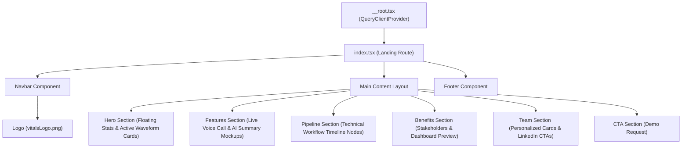

# VITALS Frontend Design Specification

Welcome to the design documentation for **VITALS — Agentic AI Healthcare Platform**. This document provides a detailed breakdown of the visual design system, UI component hierarchy, animations, color palette, and layout strategies implemented in the frontend.

---

## 1. Visual Design System

The design uses a clean, premium, and futuristic medical aesthetic. It integrates **Tailwind CSS v4** with **OKLCH** color values for high-gamut vibrancy, smooth gradients, glassmorphism, and responsive layouts.

### 1.1 Typography
- **Headings & Displays**: `Sora` (500, 600, 700, 800) – Designed to look bold, clean, and modern with a `-0.02em` letter-spacing.
- **Body & Controls**: `Inter` (400, 500, 600, 700) – High readability for clinical summaries and diagnostic text.

### 1.2 Layout Scaling (Zoom Control)
To optimize data density and readability at standard window sizes, a root-level scale factor of **80%** has been applied to the `html` element:
```css
html {
  font-size: 80%; /* Scales all rem-based sizes, gaps, padding, and margins */
}
```
This enables a default 100% browser zoom to display with the layout density of an 80% zoom scale, preventing layout overflow and ensuring dashboard elements fit neatly in the viewport.

### 1.3 Color Palette (OKLCH Color Space)
By using `oklch()`, the design maintains precise brightness (L), chroma (C), and hue (H) parameters, ensuring uniform contrast and accessibility.

| Name | Variable | OKLCH Value | UI Role / Usage |
| :--- | :--- | :--- | :--- |
| **Primary** | `--primary` | `oklch(0.52 0.22 255)` | Core branding, interactive focus, buttons, main badges |
| **Primary Glow** | `--primary-glow` | `oklch(0.7 0.18 245)` | Blurred backdrop ambient effects, glowing shadows |
| **Success** | `--success` | `oklch(0.65 0.17 155)` | Live status indicator, completed steps, satisfaction trends |
| **Warning** | `--warning` | `oklch(0.78 0.15 75)` | High priority alerts, intermediate warnings |
| **Info** | `--info` | `oklch(0.7 0.13 200)` | Helpful tips, secondary metrics, informative highlights |
| **Destructive** | `--destructive` | `oklch(0.6 0.22 25)` | Error screens, delete actions, system alerts |
| **Background** | `--background` | `oklch(0.99 0.005 240)` | Ultra-clean, slightly blue-tinted cool background |
| **Foreground** | `--foreground` | `oklch(0.18 0.04 250)` | Deep slate primary text |
| **Card** | `--card` | `oklch(1 0 0)` | Pure white card surfaces |
| **Secondary** | `--secondary` | `oklch(0.96 0.02 240)` | Off-white surfaces, passive message bubbles |
| **Border** | `--border` | `oklch(0.92 0.015 240)` | Subtle dividing lines & contours |

### 1.3 Gradients & Background Patterns
- **Hero Background (`bg-gradient-hero`)**: A smooth, multi-stop diagonal transition from light cool blue to soft white.
  ```css
  linear-gradient(135deg, oklch(0.97 0.025 240) 0%, oklch(0.94 0.04 250) 50%, oklch(0.98 0.015 230) 100%)
  ```
- **Primary Brand Gradient (`bg-gradient-primary`)**: Rich violet-blue to indigo.
  ```css
  linear-gradient(135deg, oklch(0.52 0.22 255), oklch(0.65 0.2 245))
  ```
- **Medical Grid (`.medical-grid`)**: A geometric grid simulating medical chart papers.
- **Dot Patterns (`.dot-pattern` & `.grid-pattern`)**: Subtle micro-dot grids mapping depth across the background layers.

### 1.4 Glassmorphism & Transitions
- **Glassmorphism (`.glass`)**: Used heavily in headers and overlays. Combines transparent white color with backdrop filters:
  ```css
  background: oklch(1 0 0 / 0.7);
  backdrop-filter: blur(12px);
  -webkit-backdrop-filter: blur(12px);
  ```
- **Smooth Interactions (`.hover-lift`)**: Leverages custom timing curves (`cubic-bezier(0.22, 1, 0.36, 1)`) to lift cards smoothly off the page on hover, applying a glowing brand shadow (`shadow-glow`).

---

## 2. Micro-Animations

Custom keyframe animations enrich the premium feel, giving feedback and guiding the user through layouts:

1. **`fade-in`**: Simple opacity animation for quick page loads.
2. **`fade-up`**: Smooth entry slide-up (`translateY(24px) → 0`) with deceleration bezier curve.
3. **`float`**: Cyclic translation (`translateY(0) → translateY(-10px) → translateY(0)`) running on infinite loop for metric cards, indicating active elements.
4. **`pulse-ring`**: Expanding concentric box-shadow ring used to highlight key status beacons.
5. **`shimmer`**: Shifting background-position for loading state indicators.

---

## 3. Page Layout & Component Hierarchy

The application runs on **TanStack Router** and renders within a single-page architecture defined in [index.tsx](file:///c:/Users/Aryan%20Saini/Documents/Git%20Projects/Vitals/Vitals-Rag-Powered/src/routes/index.tsx).



### 3.1 Detail Breakdown of Layout Sections

#### 1. Header & Navigation (`Navbar`)
- Sticky top layout with a glassmorphic background layer.
- Links to anchors: `#top`, `#features`, `#how`, `#impact`, `#team`.
- High-contrast primary "Sign In" button with custom glow effects.

#### 2. Hero Section (`Hero`)
- Floating cards showcase actual value propositions:
  - **Live Voice Session**: A dynamic mock waveform showing active check-in activity.
  - **Diagnostic KPI Card**: Displays `98% Successful Check-ins` with a secondary trend badge.
- Interactive stats strip summarizing patient load reduction and satisfied users.

#### 3. Features Section (`Features`)
- Integrates two highly interactive UI simulations:
  - **AI Voice Conversation**: Chat bubble dialog simulating real-time multilingual patient interaction.
  - **AI Medical Summary**: Structured summary cards illustrating symptoms, RAG-extracted insights, and medical recommendations.
- Interactive Grid: Hoverable capabilities list showing core pillars (Voice Check-in, Intelligence, History, Assessment, Approvals, Follow-ups).

#### 4. Pipeline Timeline (`Pipeline`)
- Translates the multi-agent orchestration workflow (Twilio + Vapi, Deepgram STT, ElevenLabs TTS, GPT reasoning, Doctor Approvals) into a highly readable visual timeline.
- Switches automatically between a horizontal connected timeline (on desktop) and a vertical timeline (on mobile).

#### 5. Impact & Dashboard (`Benefits`)
- Explains value propositions categorized by stakeholder roles: Nurses/Hospital Staff, Doctors, and Chronic Patients.
- Embeds a mock **AI Dashboard Preview** with trend widgets (Patient Trends, Check-ins, Priority Alerts, and Satisfaction Ratings).

#### 6. Team Grid (`Team`)
- Renders profiles of Team V.I.T.A.L.S.
- Features custom radial gradient rings around members' first initials, smooth flip/rotate indicators, and integrated social CTA links.

---

## 4. UI Library Integration (Shadcn UI)

VITALS includes a fully configured [shadcn/ui](https://ui.shadcn.com) setup inside [components.json](file:///c:/Users/Aryan%20Saini/Documents/Git%20Projects/Vitals/Vitals-Rag-Powered/components.json). 

Key UI components available in [src/components/ui/](file:///c:/Users/Aryan%20Saini/Documents/Git%20Projects/Vitals/Vitals-Rag-Powered/src/components/ui):
- **Navigation & Structures**: `sheet`, `sidebar`, `tabs`, `navigation-menu`, `breadcrumb`, `pagination`.
- **Modals & Dialogs**: `dialog`, `drawer`, `popover`, `alert-dialog`, `context-menu`, `tooltip`.
- **Inputs & Controls**: `button`, `checkbox`, `input`, `input-otp`, `radio-group`, `select`, `slider`, `switch`, `textarea`.
- **Visual Display & Data**: `card`, `badge`, `table`, `progress`, `carousel`, `accordion`, `calendar`, `chart`.

---

## 5. Coding & Expansion Standards

When modifying or expanding the frontend code, adhere to these guidelines:
1. **Adding Routes**: Use file-based routing within the `src/routes/` folder. Ensure pages register their `head` metadata for optimal SEO.
2. **Icons**: Use `lucide-react` for standard UI iconography. Keep icons aligned within container tags (`h-5 w-5` or `h-4 w-4`).
3. **Styling Extensions**: Define new theme colors, constants, or animations inside `@theme inline` in [src/styles.css](file:///c:/Users/Aryan%20Saini/Documents/Git%20Projects/Vitals/Vitals-Rag-Powered/src/styles.css) rather than adding inline CSS values inside TSX files.
4. **State Management**: Use **TanStack Query** (`@tanstack/react-query`) for API fetching and caching patterns, ensuring UI transitions gracefully between loaded and skeleton states.
